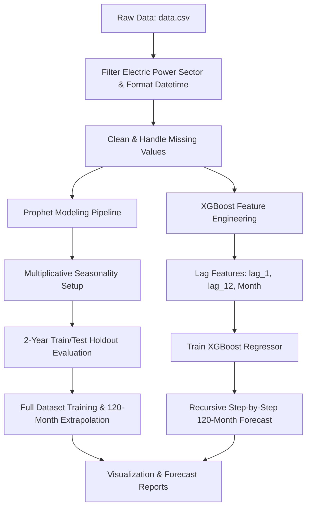

# 🌿 CO2 Emission Forecasting (10-Year Horizon)

---

## 📌 Project Overview

Energy consumption and power generation are primary contributors to greenhouse gas emissions. Analyzing historical monthly emissions trends and producing reliable 10-year forecasts provides critical insights for policymakers, environmental scientists, and energy analysts.

This project delivers:
1. **Data Preprocessing & Cleaning**: Extraction and formatting of historical monthly $\text{CO}_2$ emissions (Million Metric Tons).
2. **Feature Engineering**: Autoregressive lag creation ($\text{lag}_1, \text{lag}_{12}$) and temporal attributes (month/seasonality).
3. **Model Training & Evaluation**:
   - **Facebook Prophet**: Multiplicative seasonality model evaluated on a 2-year (24-month) holdout test set using **MAPE**, **MAE**, and **RMSE**.
   - **XGBoost Regressor**: Iterative recursive step-by-step 10-year forecasting model with dynamic feature recalculation.
4. **Notebook Generators**: Python automation scripts (`create_nb.py`, `create_prophet_nb.py`) that programmatically instantiate clean, ready-to-run Jupyter Notebooks.
5. **Report Exports**: PDF summary outputs for quick evaluation and visual distribution.

---

## 📊 Dataset Information

* **Source Target**: Total Energy Electric Power Sector $\text{CO}_2$ Emissions (`Description == "Total Energy Electric Power Sector CO2 Emissions"`)
* **Unit of Measurement**: Million Metric Tons of Carbon Dioxide ($\text{MMT CO}_2$)
* **Time Granularity**: Monthly (`YYYYMM` format transformed to datetime `ds`)

### Sample Data Format
| Date (`YYYYMM` / `ds`) | Value (`y`) | Description | Unit |
| :--- | :--- | :--- | :--- |
| `1973-01-01` | `72.076` | Total Energy Electric Power Sector CO2 Emissions | Million Metric Tons |
| `1973-02-01` | `64.442` | Total Energy Electric Power Sector CO2 Emissions | Million Metric Tons |

---

## 🔬 Methodology & Modeling Approaches

### 1. Facebook Prophet Model
* **Model Type**: Additive/Multiplicative Generalized Additive Model (GAM) decomposed into:
  $$\hat{y}(t) = g(t) \cdot s(t) + \epsilon_t$$
  where $g(t)$ represents the trend and $s(t)$ represents annual multiplicative seasonality.
* **Evaluation Protocol**: Holdout test set over the last 24 months (2 years).
* **Metrics Tracked**:
  - **MAPE** (Mean Absolute Percentage Error)
  - **MAE** (Mean Absolute Error)
  - **RMSE** (Root Mean Squared Error)

### 2. XGBoost Regressor
* **Model Type**: Gradient Boosted Decision Trees (`xgb.XGBRegressor`)
* **Feature Engineering**:
  - $\text{lag}_1$: Emission from the previous month ($t-1$)
  - $\text{lag}_{12}$: Emission from the same month of the previous year ($t-12$)
  - $\text{month}$: Ordinal month indicator ($1 \dots 12$) to capture intra-year seasonality.
* **Forecasting Mechanism**: Recursive step-by-step auto-regression. For each step $k \in [1, 120]$, predicted values are fed back into the history to construct subsequent lag features.

---